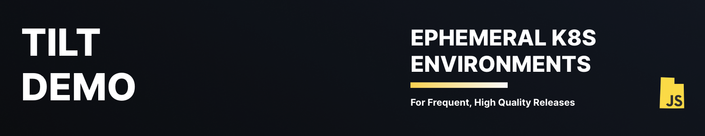

 

# Planet Express

Example use of Tilt with a NestJS backend, Postgres database, and Next frontend.


## Helpful Resources

---
### Collaborative Environments

1. Run Tilt against a remote cluster (e.g your dev cluster)
2. Add ingress routes for your frontend and backend services (e.g with k8s [nginx ingress](https://kubernetes.io/docs/concepts/services-networking/ingress/#the-ingress-resource))
3. Create a public DNS entry for your ingress (this can be done automatically using something like [External DNS](https://github.com/kubernetes-sigs/external-dns))

### UtahJS Slack

[Slack](utahjavascript.slack.com)
@gitclonedcush

## Running

It only takes a single command to run the planet express tech stack.

```bash
tilt up
```

## Destroying

```bash
tilt down
```

Completely delete your database with 

```bash
kubectl delete pvc -n default data-postgresql-0
```
